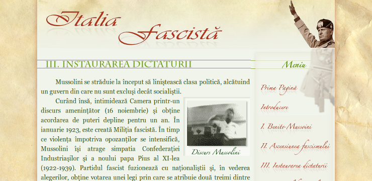

# This repository has been moved to [gitlab.com/paul-nechifor/italia-fascista](http://gitlab.com/paul-nechifor/italia-fascista).

Old readme:

# Italia fascistă

A history themed web site I build in high school for a competition in 2007.

You can [view the website][rawgit] using rawgit.com (you may want to [skip
directly to the content][content]).

Also see my [participation the previous year][rstsd].

## License

MIT

[rawgit]: https://rawgit.com/paul-nechifor/italia-fascista/master/index.html
[content]: https://rawgit.com/paul-nechifor/italia-fascista/master/partea1.html
[rstsd]: https://github.com/paul-nechifor/rstsd
